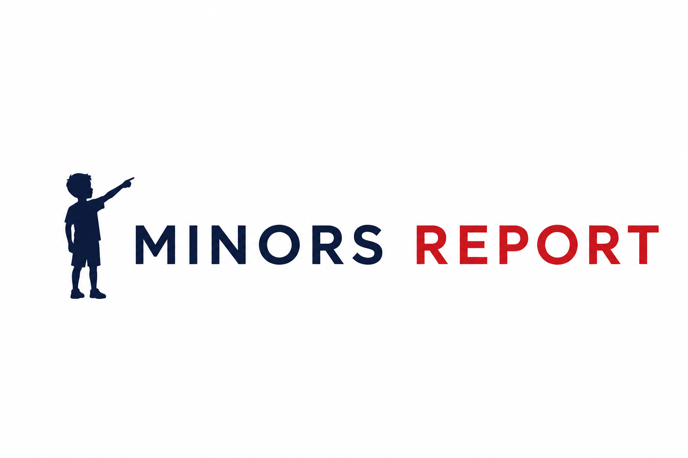

  

<h1 align="center">Minors Report</h1>

  A toolkit for image analysis, with particular emphasis on images depicting children.

  
  

---

## Overview

**Minors Report** is a pure research project designed to analyze various technologies helping identify children in multimedia.

Functionality

* minors detection in images and videos
* age estimation
* anonymization

---

## Experiments

### MLLMs for children detection

Test of multimedia large language models MLLMs in the task of child detection vs. classical neural-networks-based detectors.

---

