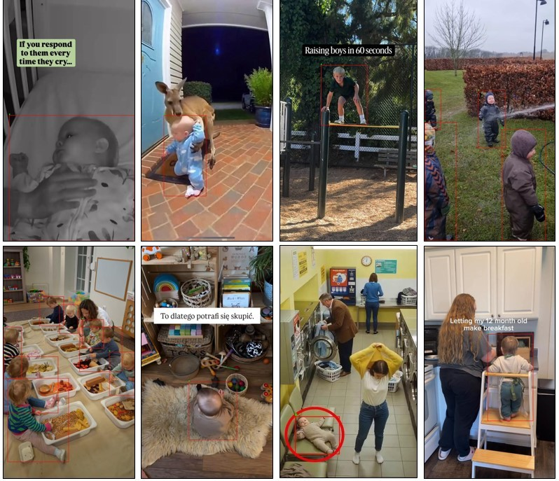

# The Parenting Slop Dataset

The Parenting Slop dataset consists of **20** movie clips showing children in various situations.  
All of them were downloaded from the Facebook Reels platform. 
The dataset contains both real and synthetic data. 
The clips were selected based on the presence of minors in different age groups and settings. A minor category is understood as a child under 14 years old of apparent age. 
Selected videos contain subjects in close-up and from a distance; children can be in groups, occluded, moving, and not looking at the camera to make the data more challenging.

All the videos were trimmed to 10 seconds to have a uniform length. 
Then they were sampled at 5 fps and saved as images in JPG format. 
As a result, 50 frames were extracted from each video, for a total of 1000 frames. 
Keyframes were annotated with rectangular bounding boxes for the `minor` category with LabelMe software. 
Adults and other objects in the images are not labeled. Bounding boxes follow the COCO object detection format.




## Motivation

The story behind this dataset started when I was on maternity leave. 
I noticed that social platforms started to suggest more movies with children to me 
(which is not surprising). Among them, I got a lot of synthetically generated movies of different animals stealing or attacking babies. 
The more I clicked on them, the stranger the animals appeared in the clips. 
My top finding was a cassowary escaping with a little kid in its beak (here I needed to check the name of the bird, because it's not popular in Poland, where I live). 
At some point, I started downloading them, as I thought some people would not believe how strange the content was that had been proposed to me. 
As I work as a researcher and my last project involved working on NSFW content with children, 
I decided to add some more diversified data to synthetic movies and create a database for further analysis of children's presence in real and AI-generated videos.


## Dataset layout

```text
PARENTING_SLOP/
├── frames/          # extracted frames: <clip_id>/frameXXXXXX.jpg
├── videos/          # trimmed source clips: <clip_id>.mp4
└── framesannotations.json  # bounding boxes for minors in COCO format
└── filesinfo.csv   # metadata about source clips
```

Dataset contains **20** clips (`0000`–`0019`) and  **1000** frames (first ~10 s of each video, sampled at 5 fps). Detection ground truth is exported in COCO format with a single category `minor`.


## Download

Dataset can be downloaded from [Zenodo](https://zenodo.org/records/22092731) and [Kaggle](https://xxxx).
